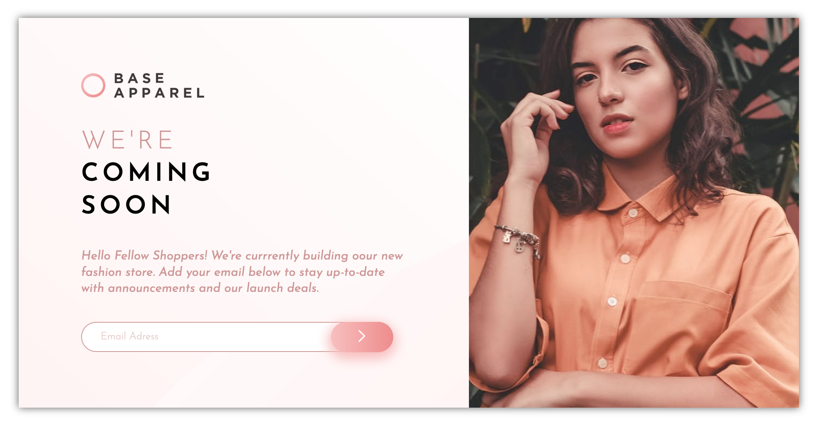

# Frontend Mentor - base-apparel coming soon page solution

This is a solution to the [Base Apparel coming soon page challenge on Frontend Mentor](https://www.frontendmentor.io/challenges/base-apparel-coming-soon-page-5d46b47f8db8a7063f9331a0). Frontend Mentor challenges help you improve your coding skills by building realistic projects.

## Table of contents

- [Project setup](#project-setup)
- [Compiles and hot-reloads for development](#compiles-and-hot-reloads-for-development)
- [compiles and minifies for production](#compiles-and-minifies-for-production)
- [Customize configuration](#customize-configuration)
  - [The challenge](#the-challenge)
  - [Screenshot](#screenshot)
  - [Links](#links)
- [My process](#my-process)
  - [Built with](#built-with)
  - [What I learned](#what-i-learned)
  - [Continued development](#continued-development)
  - [Useful resources](#useful-resources)
- [Author](#author)
- [Acknowledgments](#acknowledgments)

## Project setup

```
npm install
```

### Compiles and hot-reloads for development

```
npm run serve
```

### Compiles and minifies for production

```
npm run build
```

### Customize configuration

See [Configuration Reference](https://cli.vuejs.org/config/).

### The challenge

Users should be able to:

- View the optimal layout for the site depending on their device's screen size
- See hover states for all interactive elements on the page
- Receive an error message when the `form` is submitted if:
  - The `input` field is empty
  - The email address is not formatted correctly.

### Screenshot



### Links

- Solution URL: [Solution URL here](https://github.com/Maryahcee/base-aparrell-frontend)
- Live Site URL: [Live site URL here](https://coming-soon-a994f9.netlify.app/)

## My process

-Install Vue CLI
-create components as per card using desktop first approach
-Used vanilla css to style my card
-hosted the site using netlify

### Built with

- Semantic HTML5 markup
- CSS custom properties
- Flexbox
- Mobile-first workflow
- [Vuejs](https://vuejs.org/) - Vuejs framework
- [Styled Components](https://styled-components.com/) - For styles
